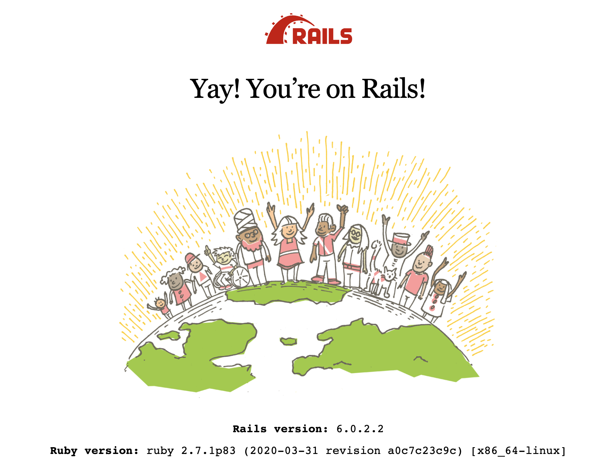

# rails-starter-kit-with-docker

Instantly, you can create a rails app.

## Screenshot



## Usage
I suppose that you already have docker machine.  
If you don't have it, please install it.
- [Docker for Mac](https://hub.docker.com/editions/community/docker-ce-desktop-mac)
- [Docker for Ubuntu](https://docs.docker.com/v17.12/install/linux/docker-ce/ubuntu/#install-docker-ce)
- [Docker for Windows](https://hub.docker.com/editions/community/docker-ce-desktop-windows)

### 1. Clone this repository to your new app directory
```
mkdir new-app
cd new-app/
git clone git@github.com:n350071/rails-starter-kit-with-docker.git
```

### 2. Copy build files
```
cd rails-starter-kit-with-docker/
make cp-build-files
```

### 3. Initialize your new project
```
make init-project
```

It starts rails and you can check it by `http://localhost:3000`.  
when you want to stop your docker, please type

```
make stop
```

## Help
```
make help
```